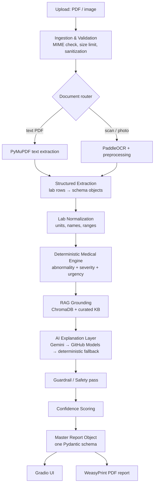

# MediScan RC1 — Architecture Overview

*Written for a beginner. Every stage explains **what** it does, **why** it exists, and the key tradeoff behind it.*

> **Implementation status (end of Sprint 6):** ingestion & validation,
> the router, PyMuPDF + PaddleOCR extraction, the full deterministic
> medical core (parser, normalization, range resolution with merged KB
> criticals, severity, urgency), AND the AI explanation layer are BUILT
> and tested. The AI platform: one medicine-blind `LLMClient` contract,
> one OpenAI-compatible provider class driving Gemini + GitHub Models
> (#024), versioned PromptTemplates with injection fencing (#025),
> structured output with one repair-retry, a resilient fallback chain
> with exponential backoff, a deterministic template floor (works with
> ZERO AI), a block-and-fall-back guardrail (#026), and provenance on
> every output. Verified live: all four outputs (patient, doctor,
> dietary, specialist) generated by Gemini, grounded in the verdict. RAG (Sprint 6) is now BUILT:
> a curated, sourced knowledge base indexed with local BGE-small
> embeddings in an in-memory ChromaDB (rebuilt from the JSON each run),
> retrieval into the existing FACTS seam, and `grounding_sources` on
> every AI explanation — with the medical engine forbidden from
> importing `rag/`, proven by a boundary test (#028).
> Still design-only: confidence scoring & async
> orchestration (Sprint 7), observability (Sprint 7), presentation
> (Sprint 8). Decisions #011-#028 refined this design.
> NOTE: no logging/observability exists yet (scheduled for Sprint 7).

---

## 1. The big picture

MediScan RC1 is a **pipeline**: a document goes in one end, an analyzed report comes out
the other. Each stage does one job and hands a well-defined data structure to the next.



**The single most important design rule:** everything that could harm someone if wrong
(severity, urgency) is computed by *deterministic code* — plain `if value > upper_limit`
logic you can read, test, and audit. The AI's job is only to **explain** in friendly
language what the rules already decided. This is called **deterministic-first, AI-explains**.

Why? An LLM is a probability machine — brilliant at language, unreliable at guarantees.
Rules are the opposite. Use each for what it's good at.

## 2. Stage-by-stage

### 2.1 Ingestion & validation (security front door)

Accepts PDF/PNG/JPG only. Checks the **real** file type by magic bytes (not the filename —
attackers rename `evil.exe` to `report.pdf`), enforces a size limit (~20 MB), writes to a
secure temp directory, and guarantees cleanup even on crashes (`try/finally`). No file
content is ever logged (PHI protection).

### 2.2 Document router + hybrid OCR

Two kinds of "PDF" exist: **text PDFs** (lab software output — the text is really there,
extractable perfectly and instantly with **PyMuPDF**) and **scanned/photographed documents**
(just pixels — need **OCR**, where a vision model reads the image). The router tries
PyMuPDF first; if a page yields almost no text, it's routed to **PaddleOCR**. OCR returns
per-word confidence scores which we keep — they feed the final confidence score, and low
confidence can trigger preprocessing (deskew, contrast) and a retry.

> macOS note: PaddleOCR install can be rough on Apple Silicon. If it fights you, we develop
> against Tesseract behind the same interface and swap PaddleOCR in later — the pipeline
> code never knows which engine ran, because both sit behind one `OcrEngine` abstraction.
> That's the point of abstractions.

### 2.3 Structured extraction

Raw text like `Hemoglobin 9.8 g/dL 13.0-17.0 L` becomes a typed object:

```python
LabResult(test_name="Hemoglobin", value=9.8, unit="g/dL",
          ref_low=13.0, ref_high=17.0, flag_in_report="L")
```

Deterministic parsing (regex + table geometry) runs **first**; the LLM is only asked to
extract when rules fail, and its output must validate against the schema or it retries.
Cheaper, faster, and more trustworthy.

### 2.4 Lab normalization

Real reports write the same test five ways ("Hb", "HGB", "Haemoglobin"). A synonym map
canonicalizes names and units so the medical engine compares apples to apples.

### 2.5 Deterministic medical engine (the heart)

**Reference-range rule:** if the report includes its own range, use it (labs calibrate
ranges to their equipment and population). Only if missing, fall back to generalized adult
ranges from our KB. Architecture keeps ranges configurable so age/gender-specific ranges
can arrive later without rewrites.

Severity bands (Normal → Critical) come from *how far outside* the range a value sits,
per-test, defined in reviewable KB data files — not hardcoded, not AI-decided. Urgency is
the conservative roll-up of all severities (one Critical flag ⇒ at least Urgent).
Every decision records its inputs, so it is fully **auditable and explainable**.

### 2.6 RAG grounding

Before the AI writes a word, we retrieve the relevant facts from our own curated knowledge
base (markdown + JSON: what each test measures, what low/high can indicate, diet/lifestyle
info, specialist mapping) using **ChromaDB** with **BGE-small-en-v1.5** embeddings (small,
free, runs locally). The AI is instructed to explain *using only the provided facts*.
RAG = "open-book exam" instead of "answer from memory" — it's the main hallucination defense.

### 2.7 AI layer with fallback chain

```
1. Gemini (free tier)          — primary
2. GitHub Models: GPT-4.1-mini — fallback A
3. GitHub Models: Phi-4        — fallback B
4. Deterministic templates     — always works, plainer language
```

One `LLMClient` interface; providers are plug-ins behind it. Every call has timeouts,
retry with exponential backoff (free tiers rate-limit — hammering them makes it worse),
and strict Pydantic validation of outputs with one repair-retry on malformed JSON.
Rung 4 matters most: **the product functions with zero working AI models**, because
severity/urgency never depended on AI in the first place. That's graceful degradation.

### 2.8 Guardrails, confidence, assembly

A safety pass checks AI text for forbidden content (diagnosis language, dosages,
prescriptions) — blocklist + pattern rules, plus a guardrail prompt upstream. Confidence
scoring is a weighted blend of OCR confidence, extraction method (rules > LLM), schema
validation success, RAG grounding presence, and fallback depth — never a naive single
number. Everything lands in one **master Pydantic schema** (`AnalysisReport`) that the UI,
the PDF, tests, and future RC2 database all consume. One schema, many consumers —
change it once, everything stays consistent.

### 2.9 Presentation

**Gradio** UI (upload → progress → color-coded results → urgency badge → download) and a
**WeasyPrint** PDF (HTML/CSS → professional clinical PDF: both summaries, findings table,
explanations, confidence, disclaimers, MediScan branding).

## 3. Orchestration (RC1)

Lightweight custom **async** orchestration — independent steps (e.g., metadata extraction,
RAG retrieval for different findings) run concurrently with `asyncio`, with timeouts and
cancellation safety. No LangGraph yet: learn raw async first, adopt the framework in RC2
when graphs of agents justify it. Steps are already structured as nodes-with-typed-inputs/
outputs, so the RC2 migration is a re-wiring, not a rewrite.

## 4. Cross-cutting rules

- **Security:** no `eval`/`exec`, no unsafe deserialization, MIME + size validation,
  prompt-injection defense (document text is *data*, never instructions — clearly fenced
  in prompts), OCR text sanitization, pinned dependencies, secure temp cleanup, CI security
  scanning.
- **Privacy/logging:** structured logs of *events and metrics only* (latency, confidence,
  fallback triggers, validation failures). Never log PHI, raw report text, or patient data.
- **Cost:** deterministic-first (most requests need few or no tokens), compressed prompts,
  cached KB retrievals, small local embeddings, retry backoff.
- **Quality:** strict typing, Ruff + Black, pytest, SOLID-but-not-overengineered. Modular
  monolith — one deployable app with clean internal domain boundaries. Microservices are
  premature here and the spec agrees.

## 5. Why these choices (summary table)

| Choice | Why | Alternative rejected because |
|---|---|---|
| Deterministic-first severity | Safety, auditability | Pure-LLM judgment can't be guaranteed |
| PyMuPDF + PaddleOCR hybrid | Free, local, best tool per doc type | Cloud OCR costs money, sends PHI to third party |
| ChromaDB + BGE-small | Free, local, simple API | Hosted vector DBs cost money, overkill for local KB |
| Gemini/GitHub Models chain | ₹0 development cost | OpenAI-primary needs a paid key |
| No Django in RC1 | No DB/auth to justify it; fewer concepts at once | Django-from-day-1 buries a beginner |
| Gradio | Fast, Python-only UI, HF Spaces native | Custom frontend = a second project |
| Modular monolith | Simple to run, clean to grow | Microservices are premature complexity |
